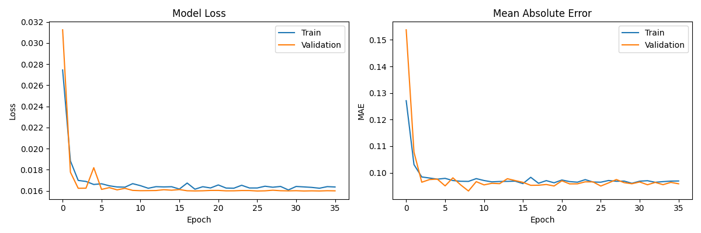
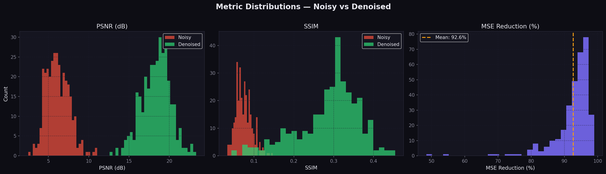
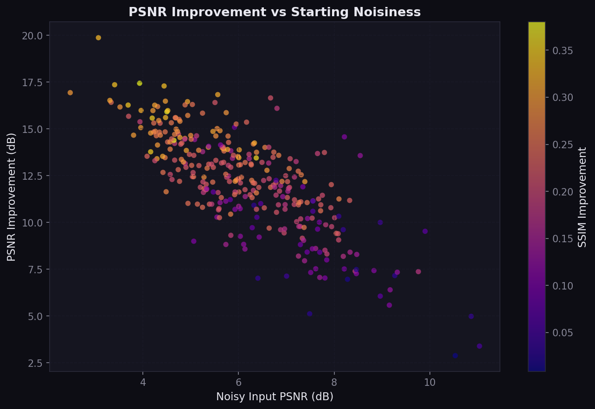
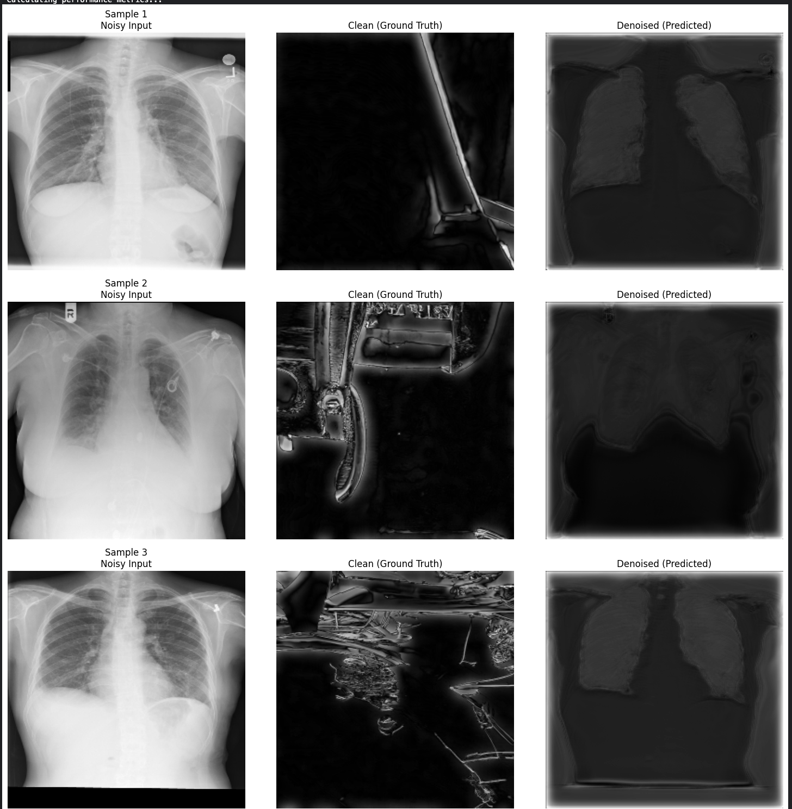

<div align="center">
  <h1>🧬 CT Denoising U-Net</h1>
  <p><i>An Advanced Deep Learning Pipeline for Medical Image Artifact Reduction</i></p>

  [](https://www.python.org/)
  [](https://www.tensorflow.org/)
  [](https://streamlit.io/)
  [](https://opensource.org/licenses/MIT)
</div>

<br />

> **A robust, end-to-end U-Net based medical image denoising framework specifically optimized for lung CT and chest X-ray scans. This platform features data synthesis, neural network training, CLI inference, and a comprehensive Streamlit dashboard for real-time diagnostic evaluation.**

## 📑 Table of Contents
- [Overview](#-overview)
- [Key Features](#-key-features)
- [Model Architecture](#-model-architecture)
- [Project Structure](#-project-structure)
- [Referenced Datasets](#-referenced-datasets)
- [Installation](#-installation)
- [Usage Guide](#-usage-guide)
  - [1. Data Preprocessing](#1-data-preprocessing)
  - [2. Model Training](#2-model-training)
  - [3. CLI Inference](#3-cli-inference)
  - [4. Web Application](#4-web-application)
- [Performance Metrics](#-performance-metrics)
- [Future Roadmap](#-future-roadmap)

---

## 🔬 Overview
In medical imaging, artifacts and noise can obscure critical diagnostic details, leading to potential misdiagnoses. The **CT Denoising U-Net** is designed to reconstruct high-fidelity medical images from degraded inputs. By leveraging a convolutional autoencoder architecture (U-Net) with skip connections, this framework effectively preserves high-frequency edge details (like vascular structures and lung nodules) while aggressively removing stochastic noise.

## ✨ Key Features
- **End-to-End Pipeline**: Complete workflow from data preprocessing and augmentation to model training and evaluation.
- **Optimized U-Net Architecture**: Features a deep convolutional backbone with mixed-precision training for accelerated performance.
- **Robust Evaluation**: Comprehensive metric tracking including PSNR (Peak Signal-to-Noise Ratio), SSIM (Structural Similarity Index), and MSE (Mean Squared Error).
- **Interactive Dashboard**: A Streamlit-based web application for real-time visual inspection and analytics.
- **Production-Ready Inference**: CLI tools tailored for batch processing of high-resolution medical datasets.

## 🧠 Model Architecture
The core model utilizes a customized **Grayscale U-Net** topology:
- **Input Dimensions**: `256 x 256 x 1`
- **Encoder Path**: Sequential downsampling blocks (`32 → 64 → 128 → 256` filters) extracting hierarchical feature representations.
- **Bottleneck**: Deepest layer utilizing `512` filters to capture maximal contextual semantics.
- **Decoder Path**: Symmetrical upsampling with **skip connections** to preserve spatial localization and recover fine-grained details lost during downsampling.
- **Optimization**: `Adam` optimizer minimizing `Mean Squared Error` with a `Sigmoid` activation output.

## 📁 Project Structure
```text
CT-Denoising-U-Net/
├── 📄 app.py                  # Streamlit web app for interactive denoising
├── 📄 preprocess.py           # Synthetic noise injection & data augmentation
├── 📄 train.py                # Model training, validation, & checkpointing
├── 📄 inference.py            # CLI tool for single/batch image denoising
├── 📄 visualize.py            # Generates publication-ready evaluation plots
├── 📦 denoising_model.h5      # Bundled, pretrained weights
├── 📊 denoising_metrics.csv   # Aggregated evaluation metrics
├── 📓 notebooks/              # Jupyter notebooks for exploratory analysis
├── 📂 results/                # Saved charts, graphs, and summary dashboards
└── 📋 requirements.txt        # Project dependencies
```

## 📚 Referenced Datasets
This framework is optimized for and evaluated against several standard open-source medical datasets:
- **COVID-19 Radiography Dataset**
- **Montgomery and Shenzhen TB Datasets**
- **LIDC-IDRI Lung Cancer Dataset**
- **NIH Chest X-ray Dataset**

## 🚀 Installation

Ensure you have Python 3.8+ installed. It is recommended to use an isolated virtual environment.

```bash
# Clone the repository
git clone https://github.com/your-username/CT-Denoising-U-Net.git
cd CT-Denoising-U-Net

# Install dependencies
pip install -r requirements.txt
```

> **Note:** For a lightweight deployment without TensorFlow training components (e.g., CI/CD or basic linting), utilize `requirements-lint.txt`.

## 💻 Usage Guide

### 1. Data Preprocessing
Generate a paired dataset (`Clean/` and `Noisy/`) from raw medical images through synthetic noise injection and augmentation.

```bash
python preprocess.py \
  --input_dir /path/to/raw_images \
  --output_dir ./data \
  --img_size 256 \
  --augment 4 \
  --noise_type mixed
```
*Creates `./data/Clean` and `./data/Noisy` populated with augmented `.png` files.*

### 2. Model Training
Train the U-Net architecture from scratch.

> **⚠️ Developer Note on Pathing:**
> `train.py` is currently configured with hardcoded Kaggle dataset paths (e.g. `/kaggle/input/lung-train-model/Train/Train/Clean`). Ensure you update these directory strings inside the script before executing local training.

```bash
python train.py
```
*Generates:* `best_denoising_model.keras`, `training_history.png`, and updates `denoising_metrics.csv`.

### 3. CLI Inference
Execute rapid inference on new clinical samples. Supports both single-image evaluation and batch folder processing.

**Single Image Processing:**
```bash
python inference.py \
  --input noisy.png \
  --output denoised.png \
  --model denoising_model.h5 \
  --compare
```

**Batch Processing (Folder Mode):**
```bash
python inference.py \
  --input_dir ./noisy_images \
  --output_dir ./denoised_results \
  --model denoising_model.h5 \
  --compare
```

### 4. Interactive Web Application
Launch the comprehensive Streamlit dashboard for real-time inference, metric reference, and qualitative analysis mapping.

```bash
streamlit run app.py
```

## 📈 Performance Metrics

The provided bundled model (`denoising_model.h5`) has been validated against `321` diverse samples, demonstrating significant quantitative improvements in diagnostic image quality:

<div align="center">

| Metric | Pre-Denoising (Noisy) | Post-Denoising (Clean) | Absolute Improvement |
|:---|:---:|:---:|:---:|
| **PSNR** | 6.13 dB | 18.34 dB | **+ 12.21 dB** |
| **SSIM** | 0.0744 | 0.2866 | **+ 0.2122** |
| **MSE Reduction** | - | - | **92.63%** |

*Success rates for quantitative improvement (PSNR, SSIM, and MSE) are **100%** across the validation set.*
</div>

### Visual Analytics
Outputs such as metric distributions, PSNR scatter plots, and training histories can be regenerated in the `results/` directory using `visualize.py`:
```bash
python visualize.py --metrics denoising_metrics.csv --output_dir ./results
```

<table>
  <tr>
    <td align="center"><b>Training History</b></td>
    <td align="center"><b>Metric Distributions</b></td>
  </tr>
  <tr>
    <td></td>
    <td></td>
  </tr>
  <tr>
    <td align="center"><b>Improvement Scatter</b></td>
    <td align="center"><b>Clinical Visualizations</b></td>
  </tr>
  <tr>
    <td></td>
    <td></td>
  </tr>
</table>

## 🔮 Future Roadmap
- [ ] Migrate `train.py` from hardcoded Kaggle paths to dynamic CLI argument parsing.
- [ ] Ensure seamless cross-compatibility for model saving/loading between modern `.keras` and legacy `.h5` formats.
- [ ] Incorporate qualitative before/after comparative outputs directly into the core documentation repository.
- [ ] Explore integrations of GAN-based or Latent Diffusion Modules (LDM) for comparative architectural benchmarking.

---
<div align="center">
  <i>Developed for advancing computational radiography and medical imaging.</i>
</div>
